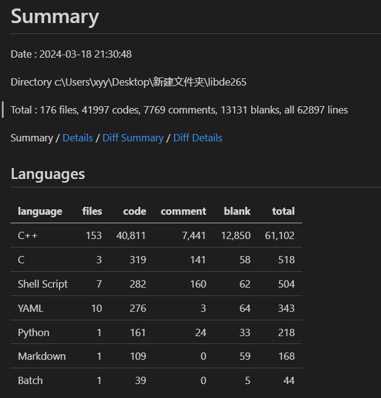

See README.md for further information at https://github.com/strukturag/libde265.

# libde265

* github：https://github.com/strukturag/libde265
* 官网：https://www.libde265.org/ 
* 官方文档：无。需要查看具体文件的参数定义。

* 为什么叫做libde265？

  * 因为解码端才是标准。编码端是随意的，只要码流的结果符合h265就行。



## 安装与编译

* ```
  sudo apt install cmake gcc g++ qt{4,5}-qmake libqt4-dev  # 安装qt4或者5都可以
  ```

* 安装x11：https://www.jianshu.com/p/66875a1f294b 

  * 能够让linux的图形化界面在windwos上显示
  * 需要重开终端

* 安装libvideogfx

  * http://github.com/farindk/libvideogfx
  * ./autogen.sh
  * ./configure

* ./autogen.sh

* ./configure

* **example编译：**

  ```
  mkdir build
  cd build
  cmake ..
  make
  =========
  make clean
  make
  ```

  * https://blog.csdn.net/ww506772362/article/details/49093271 使用：

  * 基本使用：

    * 基本参数：

      ```
      ./dec265 输入文件 -o 输出文件
      cd libde265/build/dec265
      ./dec265 /data/chenminghui/libde265/testdata/girlshy.h265 -o result.yuv 
      ```

    * 其他参数：具体看dec265/dec265.cc文件

* **libde265编译：**

  * ```
    cd libde265 
    make -j 8
    ```

* **sherlock265编译：**

  * ```
    cd sherlock265
    make -j 8
    ```

* **encoder：**

  * ffmepg编码成h265码流
  * HEVC编码成h265码流
  * x265编码成h265码流

## 码流变化：

* rgb==》yuv==》bin==》byte==》NAL    **==》slice/pps/sps/vps/sei==>** de265_image【ctb_info, pb_info ...】【结构体】

## TODO：

* 是否使用多线程
* 是否需要编程成release版本

* 要把.bashrc的搜索路径改回来
  * 是否有一些图像处理的库有冲突或者版本对应问题，需要自行注意
* 类和struct属性为方便使用改成public，是否需要改回来

## 代码解析

* 除了真实数据，还有对齐、标志，以及类型表示，都需要进行解析。
* PPS的id等数据就是用指数哥伦布编码uvlc。rice编码。
* SPS和PPS会有一些公有的属性，如果PPS没有定义，那么使用SPS的。
* "Cbf" 通常是指 "coded block flags"，它用于指示一个块（block）是否经过编码（coded）的标志位。
* “sb”：subblock。
* 跨组件预测（Cross-Component Prediction，CCP）是视频编码中的一种技术，用于在色度分量（如UV）中利用亮度分量（如Y）的信息进行预测。在许多视频编码标准中，色度分量通常以较低的分辨率进行采样，因此对色度分量进行预测时可能。
* `cu_transquant_bypass_flag`是一个标志，用于指示跳过量化的变换块。在视频编码中，变换系数会通过量化来减少数据的表示精度以实现压缩。然而，有时候跳过量化过程可以提高编码效率或减少失真，尤其是对于低比特率下的视频编码。

## decctx

### DPB

```
  std::vector<struct de265_image*> dpb; // decoded picture buffer

  std::vector<struct de265_image*> reorder_output_queue;  
  std::deque<struct de265_image*>  image_output_queue;    
```

### thread_context结构

* 保存宏块的解码数据

```
int ResScaleVal;
// residual data
uint8_t cu_transquant_bypass_flag;
uint8_t transform_skip_flag[3];
uint8_t explicit_rdpcm_flag;
uint8_t explicit_rdpcm_dir;

// we need 16 bytes of extra memory (8*int16) to shift the base for the
// alignment required for SSE code !
int16_t _coeffBuf[(32*32)+8];
int16_t *coeffBuf; // the base pointer for into _coeffBuf, aligned to 16 bytes

int16_t coeffList[3][32*32];
int16_t coeffPos[3][32*32];
int16_t nCoeff[3];

int32_t residual_luma[32*32]; // only used when cross-comp-prediction is enabled


// quantization

int IsCuQpDeltaCoded;
int CuQpDelta;
int IsCuChromaQpOffsetCoded;
int CuQpOffsetCb, CuQpOffsetCr;

int currentQPY;
int currentQG_x, currentQG_y;
int lastQPYinPreviousQG;

int qPYPrime, qPCbPrime, qPCrPrime;
```

### decoder_context

#### 解析NAL的decode函数：

* 先解析对齐、标志，以及类型表示（通过各种逻辑判断实现）
* 然后解析slice数据
* 层层包装，每一层还要几层包装
* 读取到CTB之后，还要递归读取四叉树
* 划分模式、预测模式
* 残差值、预测值
* 进行量化，熵编码
* 存储的是裸数据，比如：
  * 解析的时候可能是无符号的，那是因为能够通过各种flag，以及周围的像素进行推断。【需要保证存储的就直接是解析完后的数据】
  * 也不是简单的repeat就可以扩展到原始尺寸，猜测有一些可能还是通过比如全零标志的flag就能够存储，所以就没有还原那些数据。

#### 解析mv

* mv如何根据运动向量和引用，以及flag的状态，还原出三通道，且与原图大小相同的？

  * 保存逻辑：根据划分的pb块的`PartMode`模式，将pb_info的mv进行扩展【共享mv】

  * ```
    void de265_image::convert_mv_info(){
      const seq_parameter_set &sps = this->get_sps();
    
      int minCbSize = sps.MinCbSizeY;  //8
      const int W = this->get_width();
      const int H = this->get_height();
      mv_b.resize(H, std::vector<std::array<int, 3>>(W));
      mv_f.resize(H, std::vector<std::array<int, 3>>(W));
    
      for (int y0=0;y0<sps.PicHeightInMinCbsY;y0++)  //30*8 240 
        for (int x0=0;x0<sps.PicWidthInMinCbsY;x0++) //40*8 320
          {
            int log2CbSize = this->get_log2CbSize_cbUnits(x0,y0);
            if (log2CbSize==0) {
              continue;
            }
            //xb,yb,左上角位置，不同的partmode，同一个宏块里面，左上角位置也不同
            int xb = x0*minCbSize; 
            int yb = y0*minCbSize;
    
            int CbSize = 1<<log2CbSize;
    
            enum DrawMode what = PBMotionVectors;
            enum PartMode partMode = this->get_PartMode(xb, yb);
    
            int HalfCbSize = (1<<(log2CbSize-1));
    
            switch (partMode) {
            case PART_2Nx2N:
            PB_repeat(xb,yb,CbSize,CbSize, what);
            break;
            case PART_NxN:
            PB_repeat(xb,           yb,           CbSize/2,CbSize/2, what);
            PB_repeat(xb+HalfCbSize,yb,           CbSize/2,CbSize/2, what);
            PB_repeat(xb           ,yb+HalfCbSize,CbSize/2,CbSize/2, what);
            PB_repeat(xb+HalfCbSize,yb+HalfCbSize,CbSize/2,CbSize/2, what);
            break;
            case PART_2NxN:
            PB_repeat(xb,           yb,           CbSize  ,CbSize/2, what);
            PB_repeat(xb,           yb+HalfCbSize,CbSize  ,CbSize/2, what);
            break;
            case PART_Nx2N:
            PB_repeat(xb,           yb,           CbSize/2,CbSize, what);
            PB_repeat(xb+HalfCbSize,yb,           CbSize/2,CbSize, what);
            break;
            case PART_2NxnU:
            PB_repeat(xb,           yb,           CbSize  ,CbSize/4,   what);
            PB_repeat(xb,           yb+CbSize/4  ,CbSize  ,CbSize*3/4, what);
            break;
            case PART_2NxnD:
            PB_repeat(xb,           yb,           CbSize  ,CbSize*3/4, what);
            PB_repeat(xb,           yb+CbSize*3/4,CbSize  ,CbSize/4,   what);
            break;
            case PART_nLx2N:
            PB_repeat(xb,           yb,           CbSize/4  ,CbSize, what);
            PB_repeat(xb+CbSize/4  ,yb,           CbSize*3/4,CbSize, what);
            break;
            case PART_nRx2N:
            PB_repeat(xb,           yb,           CbSize*3/4,CbSize, what);
            PB_repeat(xb+CbSize*3/4,yb,           CbSize/4  ,CbSize, what);
            break;
            default:
            assert(false);
            break;
            }
        }
    }
    
    void de265_image::PB_repeat(int x0,int y0, int w,int h, enum DrawMode what){
        const PBMotion& mvi = this->get_mv_info(x0,y0);
        // printf("PB_repeat...%d,%d,%d,%d\n",x0,y0,w,h);
        // printf("mvb.size():%d. mvb[0].size():%d ,%d,%d\n", mv_b.size(),mv_b[0].size(),x0+w,y0+h);
        if (mvi.predFlag[0])
        {
          for (int x = x0; x < x0 + w;++x){
            for (int y = y0; y < y0 + h;++y){
              std::array<int,3> pixel_mv = { mvi.mv[0].x, mvi.mv[0].y,mvi.refIdx[0]};
              mv_b[y][x] = pixel_mv;
            }
          }
        }
        if (mvi.predFlag[1]) {
          for (int x = x0; x < x0 + w;++x){
            for (int y = y0; y < y0 + h;++y){
              std::array<int,3> pixel_mv = { mvi.mv[1].x, mvi.mv[1].y,mvi.refIdx[1]};
              mv_f[y][x] = pixel_mv;
            }
          }
        }
    }
    ```

#### 解析残差/预测值

* 残差是经过YUV变换，然后DCT变换，再减去预测像素值，再除以量化表，再进行四舍五入量化，得到，然后进行解码的。

* ```
  -->static void decode_TU(thread_context* tctx,
                        int x0,int y0,
                        int xCUBase,int yCUBase,
                        int nT, int cIdx, enum PredMode cuPredMode, bool cbf)
                        
  ---->scale_coefficients
  
  ------>scale_coefficients_internal
  
  ......
  
   int start_pos = xT+yT*stride;
   for (int y = 0; y < nT;y++)
   {
       for (int x = 0; x < nT;x++)
       {
           // real_preds[y * stride + x] = pred[y * stride + x];
           tctx->img->predictions[cIdx][start_pos+y * stride + x]=pred[y * stride + x];
       }
   }
        
        
  -------->transform_coefficients(&tctx->decctx->acceleration, coeff, coeffStride, nT, trType, pred, stride, bit_depth); 
  # coeff是解码出来的系数，pred是预测值，逻辑是对coeff进行dct或者dst逆变换，然后相加
  template <class pixel_t>
  void transform_coefficients(acceleration_functions* acceleration,
                              int16_t* coeff, int coeffStride, int nT, int trType,
                              pixel_t* dst, int dstStride, int bit_depth)
  {
    logtrace(LogTransform,"transform --- trType: %d nT: %d\n",trType,nT);
    // printf("transform.cc transform_coefficients\n");
  
    if (trType==1) {
  
      acceleration->transform_4x4_dst_add<pixel_t>(dst, coeff, dstStride, bit_depth);
  
    } else {
  
      /**/ if (nT==4)  { acceleration->transform_add<pixel_t>(0,dst,coeff,dstStride, bit_depth); }
      else if (nT==8)  { acceleration->transform_add<pixel_t>(1,dst,coeff,dstStride, bit_depth); }
      else if (nT==16) { acceleration->transform_add<pixel_t>(2,dst,coeff,dstStride, bit_depth); }
      else             { acceleration->transform_add<pixel_t>(3,dst,coeff,dstStride, bit_depth); }
    }
  
  #if 0
    printf("decoded pixels:\n");
    for (int y=0;y<nT;y++,printf("\n"))
      for (int x=0;x<nT;x++) {
        printf("%02x ",dst[y*dstStride+x]);
      }
  #endif
  }
  
  //pred is decoded pixels.
  for (int y = 0; y < nT;y++)
  {
      for (int x = 0; x < nT;x++)
      {
          // residuals[y * stride + x] = pred[y * stride + x]-real_preds[y * stride + x];
          int cur_pos = y * stride + x;
          tctx->img->residuals[cIdx][start_pos+cur_pos]=pred[cur_pos] - tctx->img->predictions[cIdx][start_pos+cur_pos];
      }
  }
  ```

### 

## slice

```
enum SliceType
{
  SLICE_TYPE_B = 0,
  SLICE_TYPE_P = 1,
  SLICE_TYPE_I = 2
};

enum PartMode
{
  PART_2Nx2N = 0,
  PART_2NxN = 1,
  PART_Nx2N = 2,
  PART_NxN = 3,
  PART_2NxnU = 4,
  PART_2NxnD = 5,
  PART_nLx2N = 6,
  PART_nRx2N = 7
};

enum PredMode
{
  MODE_INTRA,
  MODE_INTER,
  MODE_SKIP
};

enum IntraPredMode
{
  INTRA_PLANAR = 0,
  INTRA_DC = 1,
  INTRA_ANGULAR_2 = 2,
  INTRA_ANGULAR_3 = 3,
  INTRA_ANGULAR_4 = 4,
  INTRA_ANGULAR_5 = 5,
  INTRA_ANGULAR_6 = 6,
  INTRA_ANGULAR_7 = 7,
  INTRA_ANGULAR_8 = 8,
  INTRA_ANGULAR_9 = 9,
  INTRA_ANGULAR_10 = 10,
  INTRA_ANGULAR_11 = 11,
  INTRA_ANGULAR_12 = 12,
  INTRA_ANGULAR_13 = 13,
  INTRA_ANGULAR_14 = 14,
  INTRA_ANGULAR_15 = 15,
  INTRA_ANGULAR_16 = 16,
  INTRA_ANGULAR_17 = 17,
  INTRA_ANGULAR_18 = 18,
  INTRA_ANGULAR_19 = 19,
  INTRA_ANGULAR_20 = 20,
  INTRA_ANGULAR_21 = 21,
  INTRA_ANGULAR_22 = 22,
  INTRA_ANGULAR_23 = 23,
  INTRA_ANGULAR_24 = 24,
  INTRA_ANGULAR_25 = 25,
  INTRA_ANGULAR_26 = 26,
  INTRA_ANGULAR_27 = 27,
  INTRA_ANGULAR_28 = 28,
  INTRA_ANGULAR_29 = 29,
  INTRA_ANGULAR_30 = 30,
  INTRA_ANGULAR_31 = 31,
  INTRA_ANGULAR_32 = 32,
  INTRA_ANGULAR_33 = 33,
  INTRA_ANGULAR_34 = 34
};

enum IntraChromaPredMode
{
  INTRA_CHROMA_PLANAR_OR_34 = 0,
  INTRA_CHROMA_ANGULAR_26_OR_34 = 1,
  INTRA_CHROMA_ANGULAR_10_OR_34 = 2,
  INTRA_CHROMA_DC_OR_34 = 3,
  INTRA_CHROMA_LIKE_LUMA = 4
};

enum InterPredIdc
{
  // note: values have to match the decoding function decode_inter_pred_idc()
  PRED_L0 = 1,
  PRED_L1 = 2,
  PRED_BI = 3
};
```

* read函数：解析大部分标志，并判断是否可以继续执行decode。

### slice_segment_header

### SAO_info

* Sample Adaptive Offset：样例自适应补偿

* ```
  unsigned char SaoTypeIdx; // use with (SaoTypeIdx>>(2*cIdx)) & 0x3
  unsigned char SaoEoClass; // use with (SaoTypeIdx>>(2*cIdx)) & 0x3
  
  std::array<uint8_t, 3> sao_band_position;
  std::array<std::array<int8_t, 4>, 3> saoOffsetVal; // index with [][idx-1] as saoOffsetVal[]
  ```

### 重要函数：

* ```
  read_coding_unit
  read_coding_quadtree
  read_cross_comp_pred
  read_mvd_coding
  read_prediction_unit
  read_sao
  read_coding_tree_unit
  read_transform_tree
  read_transfrom_unit
  read_pcm_samples
  .....
  
  decode_coeff_abs_level_greater1
  decode_coeff_abs_level_greater1
  residual_coding
  decode_sao_*
  decode_transquant_bypass_flag
  decode_TU
  decode_part_mode
  ......
  ```

## motion

* 之所以采用array，是因为pybind11在自动类型转换时需要使用assign函数。

```
class PBMotion
{

public:
  operator int() const
  {
    return 0;
  }

  std::array<uint8_t, 2> predFlag; // which of the two vectors is actually used
  std::array<int8_t, 2> refIdx;    // index into RefPicList
  std::array<MotionVector, 2> mv;  // the absolute motion vectors
  
};

class PBMotionCoding
{
public:
  // index into RefPicList
  int8_t refIdx[2];

  // motion vector difference
  int16_t mvd[2][2]; // [L0/L1][x/y]  (only in top left position - ???)

  // enum InterPredIdc, whether this is prediction from L0,L1, or BI
  uint8_t inter_pred_idc : 2;

  // which of the two MVPs is used
  uint8_t mvp_l0_flag : 1;
  uint8_t mvp_l1_flag : 1;

  // whether merge mode is used
  uint8_t merge_flag : 1;
  uint8_t merge_idx : 3;
};
```

## intrapred

```
decode_intra_prediction
find_intra_pred_mode
```

## image

### MetaDataArray

```
 MetaDataArray()
  {
    data = NULL;
    data_size = 0;
    log2unitSize = 0;
    width_in_units = 0;
    height_in_units = 0;
  }

```

### de265_image结构

* 重写了拷贝构造函数和赋值运算符

* 大部分属性的含义，可以从分配内存的时候理解

* ```
   MetaDataArray<CTB_info> ctb_info;
   MetaDataArray<CB_ref_info> cb_info;    
   MetaDataArray<PBMotion> pb_info;        //运动向量/帧间预测模式需要保存
   std::vector<std::vector<std::array<int, 3>>> mv_f;
   std::vector<std::vector<std::array<int, 3>>> mv_b;
   MetaDataArray<uint8_t> intraPredMode;  
   MetaDataArray<uint8_t> intraPredModeC; 
   MetaDataArray<uint8_t> tu_info;       
   MetaDataArray<uint8_t> deblk_info;     //滤波参数
  
  
  
  uint8_t *pixels[3];
  std::array<std::vector<int32_t>,3> residuals;
  std::array<std::vector<uint8_t>,3> predictions;
  ```

  